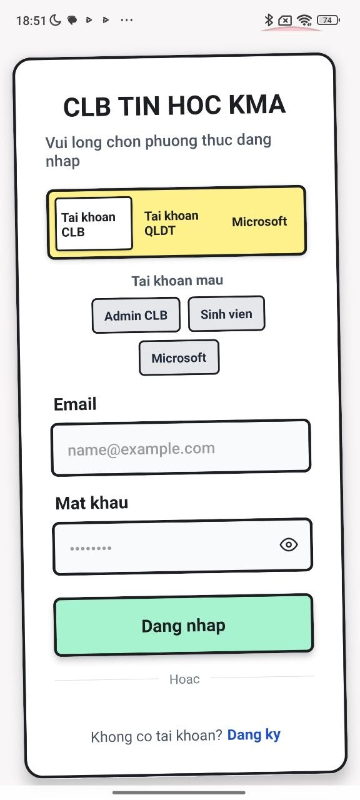
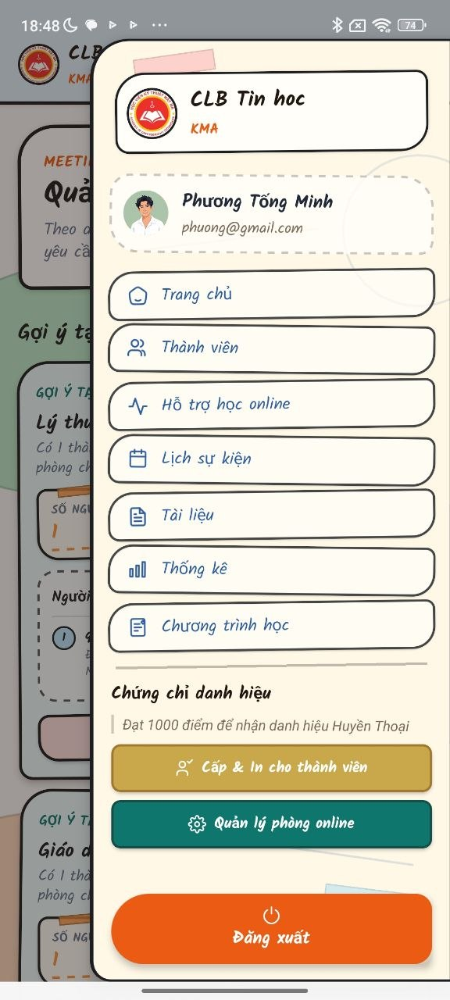
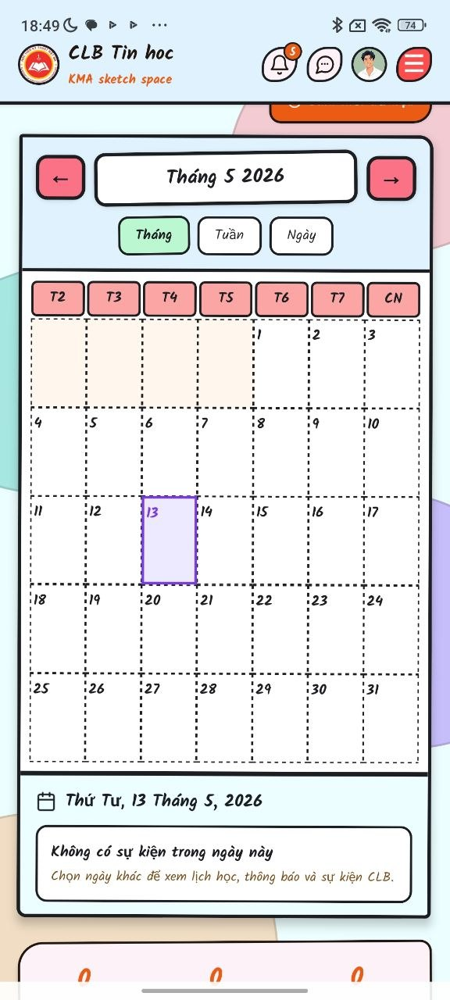
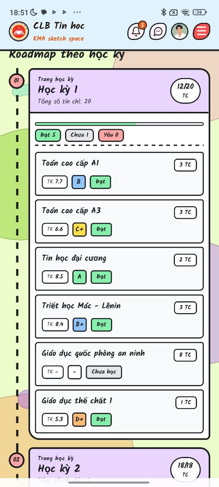
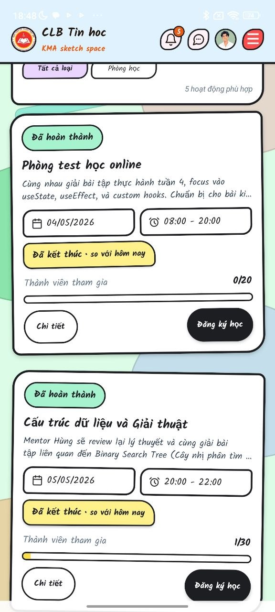
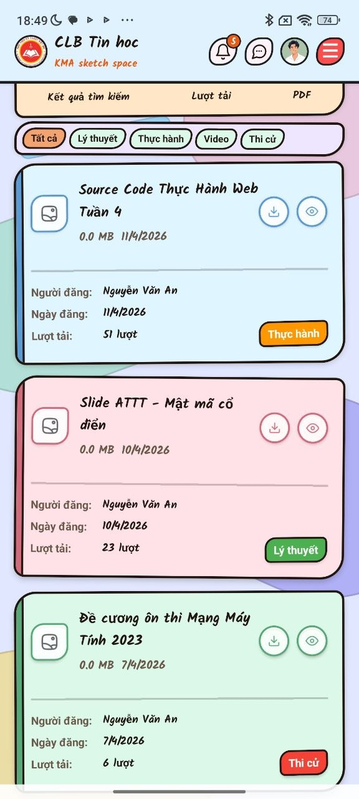

# Ứng dụng CLB Tin học

## Thông tin dự án
- Link GitHub: https://github.com/minhphuong-tmp/laptrinhdidong
- Số lượng thành viên: 01 (Full Stack Developer)

## Công nghệ sử dụng
### Frontend
- HTML, CSS, Javascript, TypeScript
- React Native (Sử dụng Expo)
- ReactJS 19 (Hooks)
- Redux (Quản lý trạng thái)

### Backend
- Node.js (Express)
- JavaScript, TypeScript
- NestJS

### Database
- Supabase

## Mô tả chức năng chính
Ứng dụng được xây dựng với đầy đủ tính năng của một mạng xã hội, được tối ưu hóa cho mô hình hoạt động của CLB Tin học.

1. Chức năng Chat & Giao tiếp
- Mã hóa đầu cuối (E2E Encryption): Đảm bảo tin nhắn chỉ được đọc trên thiết bị gửi và nhận. Dữ liệu lưu trữ tại Database hoàn toàn là mã hóa (cyphertext), không lưu plaintext.
- Hỗ trợ đầy đủ: Gọi video (Video Call), Gọi thoại (Voice Call).
- Chat nhóm, gửi hình ảnh, video, tin nhắn văn bản.

2. Hiệu năng & Trải nghiệm người dùng
- Cơ chế Cache dữ liệu: Tối ưu tốc độ phản hồi từ ~800ms xuống còn ~40ms bằng cách ưu tiên lấy dữ liệu từ Cache.
- Phân trang: Tối ưu hiển thị khi lướt xem danh sách bài viết dài.

3. Quản lý tài khoản & Bảo mật
- Đăng nhập: Hỗ trợ đăng nhập bằng tài khoản Google.
- Xác thực: Sử dụng JWT (JSON Web Token).
- Phân quyền người dùng:
  - Chủ Nhiệm CLB: Có quyền quản lý cao nhất.
  - Thành viên: Quyền hạn chế hơn.

4. Tính năng Mạng xã hội
- Bài viết: Đăng tải, Sửa, Xóa bài viết.
- Tương tác: Bình luận, Thả tim (Like) bài viết.
- Hồ sơ cá nhân: Xem và chỉnh sửa thông tin cá nhân.
- Tìm kiếm: Tìm kiếm thành viên trong CLB.

## Hình ảnh giao diện

Các hình ảnh dưới đây được trích từ file Word đồ án tốt nghiệp.

| Đăng nhập | Trang chủ |
| --- | --- |
|  |  |

| Quản lý thành viên | Thời khóa biểu |
| --- | --- |
|  |  |

| Chương trình học | Hỗ trợ học online |
| --- | --- |
|  |  |

| Thống kê | Chứng nhận |
| --- | --- |
|  |  |

| Chat | Tài liệu |
| --- | --- |
|  |  |

## Hướng dẫn cài đặt và chạy dự án

### Yêu cầu môi trường
- Node.js (Phiên bản LTS khuyến nghị)
- Thiết bị Android thật hoặc Máy ảo (Emulator)
- Ứng dụng Expo Go (nếu chạy thử nhanh) hoặc File APK Development Build (khuyến nghị cho tính năng native)

### Các bước cài đặt

1. Clone dự án và cài đặt thư viện
```bash
git clone https://github.com/minhphuong-tmp/laptrinhdidong.git
cd laptrinhdidong
npm install
```

2. Cấu hình biến môi trường
Tạo file .env và điền các thông tin cấu hình cần thiết (Supabase URL, API Keys, Google Auth Client ID...).

3. Chạy dự án với Development Build (Khuyến nghị)
Để sử dụng đầy đủ các tính năng Native (như Camera, Voice Call, Notification), bạn cần chạy trên bản Development Build (file APK custom).

Bước 1: Cài đặt file APK Development Build lên thiết bị Android của bạn. (Nếu chưa có, cần build bằng lệnh `eas build --profile development --platform android`).

Bước 2: Khởi chạy Development Server
```bash
npx expo start --dev-client
```

Bước 3: Trên điện thoại, mở ứng dụng Development Build đã cài đặt và kết nối tới server (quét QR code hoặc nhập IP máy tính).

4. Chạy dự án với Expo Go (Giới hạn tính năng)
Nếu chỉ cần kiểm tra giao diện cơ bản:
```bash
npx expo start
```
Quét mã QR bằng ứng dụng Expo Go.

## Lưu ý
- Dự án sử dụng React Native với Expo.
- Một số tính năng như Video Call hay E2E Encryption có thể yêu cầu chạy trên thiết bị thật để hoạt động chính xác nhất.
